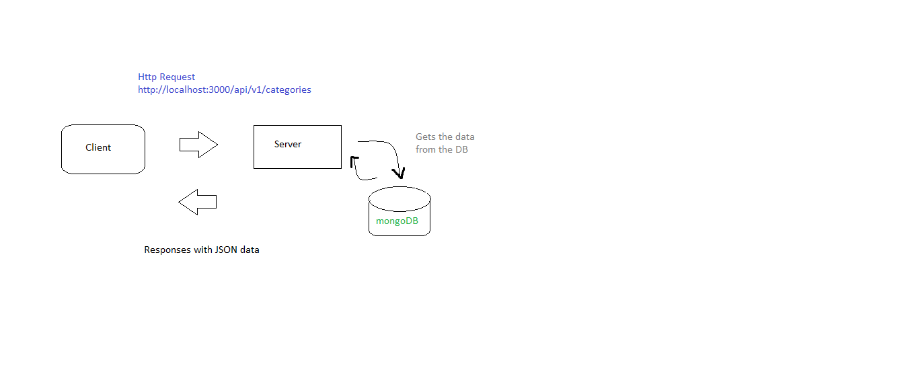

# LAB - Class 08

## Project: Api-Server

### Author: Anolla Haddad

### Links and Resources

- [swagger](https://app.swaggerhub.com/apis/Anolla/lab-08/0.1)
- [submission PR](https://github.com/401-advanced-javascript-Anolla/api-server/pull/3)
- [ci/cd](https://github.com/401-advanced-javascript-Anolla/api-server/runs/731816439)

### Setup

#### `.env` requirements (where applicable)

- `PORT` - 3000

#### How to initialize/run your application (where applicable)

- `npm start`

#### Tests

- `npm test`

#### UML

